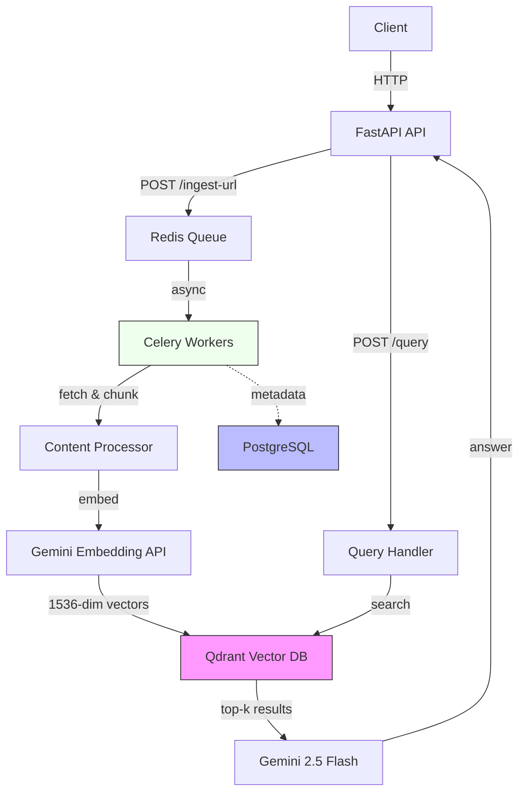

# WebRAG - Scalable Web-Aware RAG Engine

<div align="center">


[](./LICENSE)
[](https://www.python.org/downloads/)
[](https://fastapi.tiangolo.com)
[](https://www.docker.com/)

**A production-ready, web-aware Retrieval-Augmented Generation engine demonstrating modern AI engineering practices**

[Quick Start](#quick-start) • [Architecture](#architecture) • [Tech Stack](#technology-stack) • [Documentation](#documentation)

</div>

---

## Project Overview

**WebRAG** is a scalable RAG engine that grounds Large Language Model responses in factual, web-sourced data. This project demonstrates production-ready architecture patterns, modern AI stack integration, and distributed systems design.

### Core Capabilities

- **Async-first architecture** using FastAPI, Celery, and Redis for scalable background processing
- **Optimized embeddings** with Google Gemini embedding-001 configured at 1536 dimensions
- **Vector search** powered by Qdrant with metadata filtering capabilities
- **Job tracking** using PostgreSQL with ACID guarantees
- **Containerized deployment** via Docker Compose for reproducible environments
- **Comprehensive testing** with integration test suite validating end-to-end workflows

### Problem Statement

Large Language Models often lack access to current information, generate hallucinated responses, and cannot provide source attribution for their answers.

### Solution Architecture

WebRAG addresses these limitations through a three-stage pipeline:

1. **Ingestion**: Asynchronously fetch and chunk web content into a vector database
2. **Retrieval**: Use semantic search to find relevant context for user queries
3. **Generation**: Ground LLM responses in retrieved data with verifiable source citations

---

## Quick Start

### Prerequisites

- Docker 24+ with Docker Compose
- Google AI API Key ([obtain here](https://ai.google.dev/))
- curl (for testing)

### Setup Instructions

```bash
# Clone the repository
git clone <repository-url>
cd webrag

# Configure environment
cp .env.example .env
# Edit .env and add your GOOGLE_API_KEY

# Launch all services
docker compose -f docker/docker-compose.yml up -d --build

# Verify system health
curl http://localhost:8000/health
```

### Basic Usage

```bash
# Ingest a document
curl -X POST "http://localhost:8000/ingest-url" \
  -H "Content-Type: application/json" \
  -d '{"url": "https://en.wikipedia.org/wiki/Artificial_intelligence"}'

# Query the knowledge base
curl -X POST "http://localhost:8000/query" \
  -H "Content-Type: application/json" \
  -d '{"question": "What is artificial intelligence?", "top_k": 5}'
```

**For detailed setup instructions, see [docs/SETUP.md](./docs/SETUP.md)**

---

## Architecture

### System Design

WebRAG implements a distributed, async-first architecture optimized for scalable document processing and low-latency query responses.



### Ingestion Pipeline

1. Client submits URL via `POST /ingest-url`
2. FastAPI validates request and creates job record in PostgreSQL with status `pending`
3. Job is enqueued to Redis; API returns `202 Accepted` with `job_id`
4. Celery worker dequeues task, fetches and sanitizes web content
5. Content is chunked using RecursiveCharacterTextSplitter (800 tokens, 100-token overlap)
6. Chunks are embedded via Gemini API with output_dimensionality=1536
7. Vectors are stored in Qdrant with metadata (source_url, job_id, chunk_index)
8. Job status is updated to `completed` in PostgreSQL

### Query Pipeline

1. Client submits question via `POST /query`
2. Question is embedded using Gemini embedding-001 (1536 dimensions)
3. Qdrant performs similarity search using cosine distance, returns top-k chunks
4. Retrieved context and question are sent to Gemini 2.5 Flash for answer generation
5. API returns grounded answer with source citations and metadata

---

## Technology Stack

### Core Components

| Layer | Technology | Version | Purpose |
|-------|-----------|---------|---------|
| **API Framework** | FastAPI | 0.95+ | Async HTTP API with automatic validation |
| **Task Queue** | Celery | 5.x | Distributed background job processing |
| **Message Broker** | Redis | 7.x | Job queue and result backend |
| **Embeddings** | Google Gemini embedding-001 | Latest | 1536-dimensional vector generation |
| **LLM** | Gemini 2.5 Flash | Latest | Answer generation and reasoning |
| **Vector Database** | Qdrant | 1.x | Vector storage with metadata filtering |
| **Metadata Database** | PostgreSQL | 15.x | Job tracking and audit logs |
| **Deployment** | Docker Compose | 24+ | Container orchestration |

### Embedding Dimensionality Optimization

The Gemini embedding-001 model outputs 3072-dimensional vectors by default. This system explicitly configures it to use **1536 dimensions** via the `output_dimensionality` parameter, achieving:

- **Equivalent Quality**: MTEB benchmark score of 68.32, identical to the full 3072-dimension configuration
- **50% Storage Reduction**: Using 1536 dimensions instead of the default 3072 reduces vector storage requirements by half
- **Improved Performance**: Smaller vectors mean lower memory footprint and faster similarity computations
- **Cost Efficiency**: Reduced storage costs and lower API egress when transferring vectors

This optimization is implemented via the `output_dimensionality=1536` parameter in all Gemini API embedding calls (see `app/services/embeddings.py`).

**Reference**: [Google AI Embeddings Documentation](https://ai.google.dev/gemini-api/docs/embeddings) - Gemini uses Matryoshka Representation Learning, allowing dimension reduction without quality loss.

---

## API Reference

### Endpoints

| Method | Path | Description |
|--------|------|-------------|
| `POST` | `/ingest-url` | Enqueue a URL for asynchronous ingestion |
| `POST` | `/query` | Query the knowledge base with natural language |
| `GET` | `/status/{job_id}` | Retrieve ingestion job status and progress |
| `GET` | `/health` | System health check across all services |
| `GET` | `/docs` | Interactive API documentation (Swagger UI) |

### Example: Query Endpoint

**Request:**
```bash
curl -X POST "http://localhost:8000/query" \
  -H "Content-Type: application/json" \
  -d '{
    "question": "What is retrieval augmented generation?",
    "top_k": 5
  }'
```

**Response:**
```json
{
  "answer": "Retrieval Augmented Generation (RAG) is a technique that combines information retrieval with text generation to produce factually grounded responses...",
  "sources": [
    {
      "text": "RAG systems retrieve relevant documents from a knowledge base...",
      "source_url": "https://en.wikipedia.org/wiki/Retrieval-augmented_generation",
      "relevance_score": 0.8934
    }
  ],
  "metadata": {
    "embedding_model": "gemini-embedding-001",
    "embedding_dimensions": 1536,
    "llm_model": "gemini-2.5-flash",
    "processing_time_ms": 1240
  }
}
```

**For comprehensive API examples and usage patterns, see [docs/API_ENDPOINTS.md](./docs/API_ENDPOINTS.md)**

---

## Database Schemas

### PostgreSQL Schema

The system uses PostgreSQL to track ingestion jobs and maintain audit trails.

```sql
CREATE TABLE url_ingestion_jobs (
  id UUID PRIMARY KEY DEFAULT gen_random_uuid(),
  url TEXT NOT NULL,
  status VARCHAR(32) NOT NULL DEFAULT 'pending',
  created_at TIMESTAMP WITH TIME ZONE DEFAULT now(),
  updated_at TIMESTAMP WITH TIME ZONE DEFAULT now(),
  chunk_count INTEGER DEFAULT 0,
  processed_chunks INTEGER DEFAULT 0,
  error TEXT NULL,
  metadata JSONB DEFAULT '{}',
  CONSTRAINT url_not_empty CHECK (length(url) > 0)
);

CREATE INDEX idx_url_ingestion_jobs_status ON url_ingestion_jobs(status);
CREATE INDEX idx_url_ingestion_jobs_created_at ON url_ingestion_jobs(created_at);
```

### Qdrant Collection Configuration

Vector collection is configured with cosine similarity and HNSW indexing for efficient approximate nearest neighbor search.

```json
{
  "name": "web_documents",
  "vector_size": 1536,
  "distance": "Cosine",
  "hnsw_config": {
    "m": 16,
    "ef_construct": 100
  }
}
```

**Point Payload Structure:**
```json
{
  "job_id": "550e8400-e29b-41d4-a716-446655440000",
  "source_url": "https://example.com/article",
  "chunk_index": 3,
  "text": "Actual chunk content...",
  "embedding_model": "gemini-embedding-001",
  "embedding_dimensions": 1536
}
```

---

## Key Design Decisions

### Async Architecture (FastAPI + Celery + Redis)

**Rationale:**
- **Non-blocking APIs**: Endpoints return immediately while processing occurs in background
- **Horizontal Scalability**: Workers can be scaled independently of the API layer
- **Fault Tolerance**: Durable job queue with automatic retries and error recovery
- **Operational Visibility**: Worker monitoring via Celery Flower

**Trade-off**: Increased architectural complexity in exchange for production-grade scalability and reliability.

### Vector Database: Qdrant

Comparison of production vector databases:

| Feature | Qdrant | FAISS | ChromaDB |
|---------|--------|-------|----------|
| Production-Ready | Yes | Limited | Yes |
| Metadata Filtering | Yes | No | Yes |
| Persistence | Native | Manual | Native |
| HTTP API | Yes | No | Yes |
| HNSW Index | Yes | Yes | Yes |

**Decision**: Qdrant selected for production-ready metadata filtering capabilities and native HTTP API, essential for filtered retrieval based on source attributes.

### PostgreSQL for Metadata Storage

**Rationale:**
- **ACID Guarantees**: Critical for reliable job state transitions
- **Query Flexibility**: JSONB support for extensible metadata schemas
- **Operational Maturity**: Well-established backup, replication, and monitoring tools
- **Indexing**: Efficient lookups on job status and temporal queries

### Chunking Strategy

**Configuration:**
- Chunk size: 800 tokens
- Overlap: 100 tokens
- Splitter: RecursiveCharacterTextSplitter

**Rationale:**
- Balances LLM context window constraints with semantic completeness
- Overlap preserves context continuity across chunk boundaries
- Recursive splitting respects document structure (paragraphs, sentences)

---

## Project Structure

```
webrag/
├── app/
│   ├── main.py              # FastAPI application and route handlers
│   ├── config.py            # Environment configuration management
│   ├── database.py          # SQLAlchemy database connection
│   ├── celery_app.py        # Celery application factory
│   ├── models.py            # ORM model definitions
│   ├── services/            # Business logic layer
│   │   ├── content_processor.py
│   │   ├── embeddings.py    # Gemini embedding client
│   │   ├── llm.py           # Gemini 2.5 Flash client
│   │   └── vectorstore.py   # Qdrant client wrapper
│   ├── tasks/               # Celery task definitions
│   │   └── ingestion.py
│   └── utils/               # Utility functions
├── docker/
│   ├── docker-compose.yml   # Service orchestration
│   └── Dockerfile           # Container image definition
├── docs/                    # Documentation
│   ├── API_ENDPOINTS.md     # Comprehensive API guide
│   └── SETUP.md             # Deployment instructions
├── scripts/
│   └── init_db.sql          # Database initialization
├── tests/
│   └── test_integration.py  # End-to-end test suite
├── requirements.txt         # Python dependencies
├── LICENSE                  # MIT License
└── README.md               # Project documentation
```

---

## Testing

### Running Tests

```bash
# Execute full test suite
python -m pytest tests/ -v

# Run with coverage report
python -m pytest tests/ --cov=app --cov-report=html
```

### Test Coverage

The integration test suite validates:

- System health checks across all services
- URL ingestion workflow and job creation
- Job status tracking and state transitions
- Asynchronous processing completion
- End-to-end RAG pipeline (ingestion through query)
- Metadata filtering capabilities
- Input validation and error handling
- Edge case scenarios

---

## Production Optimization

### Horizontal Scaling

```bash
# Scale Celery workers for increased throughput
docker compose -f docker/docker-compose.yml up --scale worker=10 -d
```

### Performance Tuning

- **Batch Embedding**: Process up to 128 chunks per API call
- **Query Caching**: Redis-based caching for frequently asked questions
- **Async I/O**: All network operations use async/await patterns
- **HNSW Configuration**: Tunable `ef_search` parameter for speed/accuracy trade-offs

### Monitoring and Observability

- **Health Checks**: `/health` endpoint for load balancer integration
- **Structured Logging**: JSON-formatted logs with job_id correlation
- **Worker Monitoring**: Celery Flower dashboard for task inspection
- **Planned**: Prometheus metrics and Grafana dashboards

---

## Troubleshooting

| Issue | Solution |
|-------|----------|
| **Embedding dimension mismatch** | Verify `EMBEDDING_DIMENSIONS=1536` in `.env` and Qdrant collection vector_size is 1536 |
| **No documents found in queries** | Check job status via `GET /status/{job_id}` to confirm completion |
| **API quota exceeded errors** | Review [Google AI Studio quota](https://aistudio.google.com/), implement exponential backoff |
| **Workers not processing jobs** | Verify Redis connectivity and check worker logs: `docker logs webrag_worker_1` |
| **Port conflicts on startup** | Check for existing services on ports 8000, 5432, 6379, 6333 |

**For detailed troubleshooting, see [docs/SETUP.md](./docs/SETUP.md)**

---

## Future Enhancements

- **Hybrid Search**: Combine BM25 lexical search with semantic search for improved precision
- **Cross-Encoder Re-ranking**: Fine-grained relevance scoring for retrieved chunks
- **Semantic Chunking**: Topic-based document splitting for better context preservation
- **Authentication**: JWT-based API authentication and authorization
- **Rate Limiting**: Per-user request quotas and throttling
- **Monitoring Dashboard**: Prometheus and Grafana integration
- **A/B Testing Framework**: Systematic comparison of embedding and retrieval strategies

---

## Technical Highlights

This project demonstrates:

1. **Modern AI Stack Integration**: Google Gemini embeddings, LLM, and production vector search
2. **Distributed Systems Design**: Asynchronous job processing, horizontal scalability, fault tolerance
3. **Production Engineering**: Health checks, retries, idempotent operations, structured logging
4. **Cost Optimization**: Strategic dimension reduction (50% storage) while maintaining quality
5. **Clean Architecture**: Separation of concerns, dependency injection, modular service design
6. **DevOps Practices**: Containerization, one-command deployment, reproducible environments
7. **Quality Assurance**: Integration testing covering end-to-end workflows
8. **Documentation**: Comprehensive guides, API documentation, architecture diagrams

---

## Documentation

- **[Setup Guide](./docs/SETUP.md)** - Deployment and configuration instructions
- **[API Reference](./docs/API_ENDPOINTS.md)** - Comprehensive endpoint documentation with examples
- **[Interactive Docs](http://localhost:8000/docs)** - Swagger UI (available when system is running)

---

## License

This project is licensed under the MIT License. See the [LICENSE](./LICENSE) file for details.

---

<div align="center">

**Technology Stack**: FastAPI • Celery • Redis • PostgreSQL • Qdrant • Google Gemini • Docker

Built by Sourabh Kapure

</div>