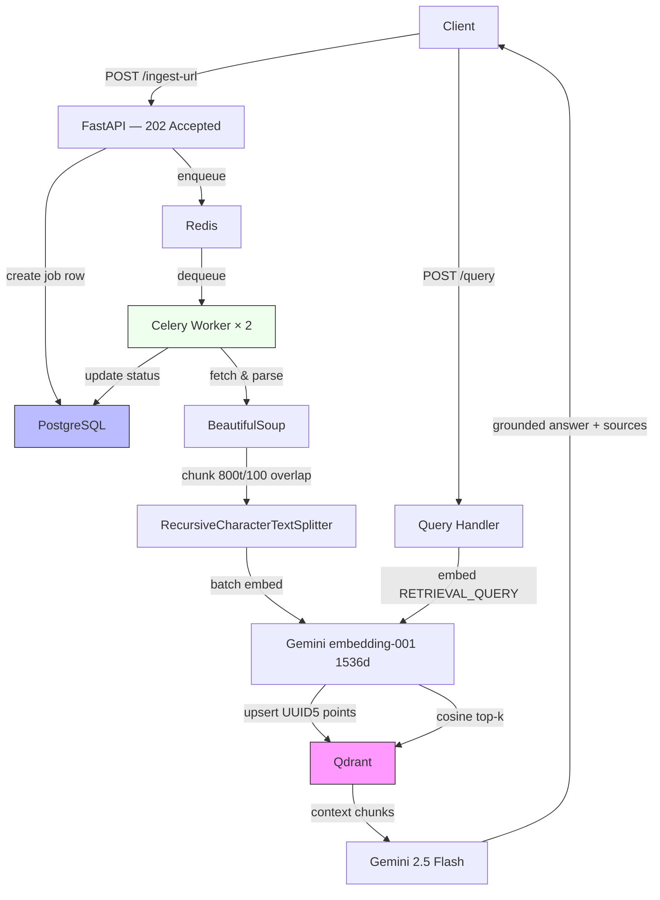

# WebRAG — Scalable Web-Aware RAG Engine

<div align="center">

[](https://www.python.org/downloads/)
[](https://fastapi.tiangolo.com)
[](https://qdrant.tech)
[](./LICENSE)
[](https://www.docker.com/)

**A production-ready, web-aware Retrieval-Augmented Generation engine demonstrating modern AI engineering practices**

[Quick Start](#quick-start) · [Architecture](#architecture) · [API Reference](#api-reference) · [Design Decisions](#key-design-decisions)

</div>

---

## Overview

**WebRAG** grounds Large Language Model responses in live, web-sourced data. It demonstrates production-level distributed system design, modern AI stack integration, and cloud-native deployment — built for technical depth rather than demo breadth.

### Core Capabilities

- **Two-phase async ingestion** — `POST /ingest-url` returns `202 Accepted` immediately; a Celery worker processes the URL in the background
- **Semantic vector search** — Qdrant with cosine similarity and UUID5-keyed points for idempotent re-ingestion
- **Gemini embeddings** — `gemini-embedding-001` at 1536 dimensions via the modern `google-genai` SDK with true batch embedding
- **Grounded generation** — Gemini 2.5 Flash answers with source citations from retrieved context
- **Dual-DB strategy** — asyncpg/SQLAlchemy for the async API; psycopg2 for Celery workers (avoids event-loop conflicts)
- **Multi-component health endpoint** — single `/health` call checks Postgres, Redis, Qdrant, and Celery workers

---

## Quick Start

### Prerequisites

- Docker 24+ with Docker Compose
- Google AI API Key — [obtain here](https://aistudio.google.com/)

### Setup

```bash
git clone <repository-url>
cd webrag

cp .env.example .env
# Add your GOOGLE_API_KEY to .env

docker compose -f docker/docker-compose.yml up -d --build
```

Verify all services are healthy:

```bash
curl http://localhost:8000/health
```

### Basic Workflow

```bash
# 1. Ingest a URL — returns 202 immediately with a job_id
curl -sS -X POST http://localhost:8000/ingest-url \
  -H "Content-Type: application/json" \
  -d '{"url": "https://en.wikipedia.org/wiki/Retrieval-augmented_generation"}' | jq .

# 2. Poll until status == "completed"
curl http://localhost:8000/status/<JOB_ID>

# 3. Query the knowledge base
curl -sS -X POST http://localhost:8000/query \
  -H "Content-Type: application/json" \
  -d '{"question": "What is RAG?", "top_k": 5}' | jq .answer
```

See [docs/SETUP.md](./docs/SETUP.md) for full deployment instructions.

---

## Architecture

### System Design


```mermaid
flowchart TD
  A[Client] -->|POST /ingest-url| B[FastAPI — 202 Accepted]
  B -->|create job row| J[PostgreSQL]
  B -->|enqueue| C[Redis]
  C -->|dequeue| E[Celery Worker × 2]
  E -->|fetch & parse| F[BeautifulSoup]
  F -->|chunk 800t/100 overlap| G[RecursiveCharacterTextSplitter]
  G -->|batch embed| H[Gemini embedding-001 1536d]
  H -->|upsert UUID5 points| I[Qdrant]
  E -->|update status| J

  A -->|POST /query| D[Query Handler]
  D -->|embed RETRIEVAL_QUERY| H
  H -->|cosine top-k| I
  I -->|context chunks| K[Gemini 2.5 Flash]
  K -->|grounded answer + sources| A

  style I fill:#f9f,stroke:#333
  style J fill:#bbf,stroke:#333
  style E fill:#efe,stroke:#333
```

### Ingestion Pipeline

| Step | Action | Component |
|------|--------|-----------|
| 1 | `POST /ingest-url` — validate URL, create DB row (`pending`) | FastAPI |
| 2 | Enqueue Celery task, return `202 Accepted` with `job_id` | Redis |
| 3 | Worker fetches and parses HTML with BeautifulSoup | Content Processor |
| 4 | Chunk with `RecursiveCharacterTextSplitter` (800t, 100t overlap) | LangChain Text Splitters |
| 5 | Batch embed all chunks in a single Gemini API call (`RETRIEVAL_DOCUMENT`) | Gemini embedding-001 |
| 6 | Upsert to Qdrant with deterministic UUID5 point IDs | Qdrant |
| 7 | Update PostgreSQL row to `completed` | asyncpg |

### Query Pipeline

| Step | Action |
|------|--------|
| 1 | Embed question with `RETRIEVAL_QUERY` task type (correct asymmetric embedding) |
| 2 | Cosine similarity search in Qdrant, retrieve top-k chunks |
| 3 | Build prompt with retrieved context; generate answer via Gemini 2.5 Flash |
| 4 | Return grounded answer with source URLs and relevance scores |

---

## Technology Stack

| Layer | Technology | Version |
|-------|-----------|---------|
| API Framework | FastAPI | 0.135.1 |
| AI SDK | google-genai | 1.65.0 |
| Embeddings | gemini-embedding-001 | 1536-dim |
| LLM | Gemini 2.5 Flash | — |
| Vector DB | Qdrant | 1.17.0 |
| Task Queue | Celery + Redis | 5.5.2 + 5.3.1 |
| Metadata DB | PostgreSQL + asyncpg | 15 + 0.31.0 |
| Validation | Pydantic v2 | 2.12.5 |
| Deployment | Docker Compose | 24+ |

### Embedding Dimensionality

`gemini-embedding-001` outputs 3072-dim vectors by default. This system pins `output_dimensionality=1536` via `EmbedContentConfig`, which uses Matryoshka Representation Learning to truncate without quality loss:

- **50% storage reduction** in Qdrant (half the bytes per vector)
- **Faster similarity search** — smaller vectors → lower HNSW memory footprint
- **Correct task types** — `RETRIEVAL_DOCUMENT` for indexing, `RETRIEVAL_QUERY` for search (per Google's embedding guidance)

---

## API Reference

| Method | Endpoint | Status | Description |
|--------|----------|--------|-------------|
| `POST` | `/ingest-url` | `202` | Enqueue a URL for async ingestion |
| `GET` | `/status/{job_id}` | `200` | Check job status and chunk count |
| `POST` | `/query` | `200` | Query the knowledge base |
| `GET` | `/health` | `200` | Multi-component health check |
| `GET` | `/docs` | `200` | Swagger UI (interactive) |

### Ingest URL

```bash
curl -sS -X POST http://localhost:8000/ingest-url \
  -H "Content-Type: application/json" \
  -d '{"url": "https://example.com/article", "metadata": {"category": "tech"}}' | jq .
```

```json
{
  "job_id": "550e8400-e29b-41d4-a716-446655440000",
  "status": "pending",
  "message": "Job accepted",
  "estimated_time_seconds": 30
}
```

### Query

```bash
curl -sS -X POST http://localhost:8000/query \
  -H "Content-Type: application/json" \
  -d '{"question": "What is retrieval-augmented generation?", "top_k": 5}' | jq .
```

```json
{
  "answer": "Retrieval-Augmented Generation (RAG) combines information retrieval with neural generation...",
  "sources": [
    {
      "text": "RAG systems retrieve relevant documents...",
      "source_url": "https://en.wikipedia.org/wiki/Retrieval-augmented_generation",
      "relevance_score": 0.8934
    }
  ],
  "metadata": {
    "embedding_model": "gemini-embedding-001",
    "llm_model": "gemini-2.5-flash",
    "chunks_retrieved": 5,
    "processing_time_ms": 1240
  }
}
```

See [docs/API_ENDPOINTS.md](./docs/API_ENDPOINTS.md) for full examples including error responses and metadata filters.

---

## Database Schemas

### PostgreSQL — Job Tracking

```sql
CREATE TABLE url_ingestion_jobs (
  id          UUID PRIMARY KEY DEFAULT gen_random_uuid(),
  url         TEXT NOT NULL,
  status      VARCHAR(32) NOT NULL DEFAULT 'pending',
  created_at  TIMESTAMPTZ DEFAULT now(),
  updated_at  TIMESTAMPTZ DEFAULT now(),
  chunk_count INTEGER DEFAULT 0,
  error_message TEXT,
  metadata    JSONB DEFAULT '{}'
);

CREATE INDEX idx_jobs_status ON url_ingestion_jobs(status);
CREATE INDEX idx_jobs_created ON url_ingestion_jobs(created_at DESC);
```

### Qdrant — Vector Collection

```json
{
  "name": "web_documents",
  "vector_size": 1536,
  "distance": "Cosine"
}
```

**Point ID scheme**: `uuid5(NAMESPACE_URL, "{job_id}-{chunk_index}")` — deterministic, collision-free, enables idempotent re-ingestion.

**Point payload**:
```json
{
  "job_id": "550e8400-...",
  "source_url": "https://example.com",
  "chunk_index": 3,
  "text": "Chunk content...",
  "embedding_model": "gemini-embedding-001"
}
```

---

## Key Design Decisions

### Two-Phase Async Model

`POST /ingest-url` returns `202 Accepted` instantly — the HTTP request never blocks on I/O. The client uses `GET /status/{job_id}` to poll. This is the same contract as Stripe's async API. Celery provides durable retry on failure, dead-letter logging, and horizontal worker scaling — things FastAPI `BackgroundTasks` cannot offer.

### Dual-DB Strategy

The API layer uses `asyncpg` (via SQLAlchemy async) — async-native for non-blocking request handling. Celery workers use `psycopg2` — the synchronous driver, because Celery tasks run in their own threads and do not share the FastAPI event loop.

### Idempotent Vector Storage

Point IDs are `uuid5(NAMESPACE_URL, f"{job_id}-{chunk_index}")` — deterministic given the same inputs. Re-ingesting the same URL generates identical point IDs, making upserts safe and duplicate-free. The previous `hash()` approach was non-deterministic (Python hash randomization) and risked silent data corruption.

### Shared Service Singletons

`GeminiEmbeddings`, `QdrantStore`, and `GeminiLLM` are constructed once during `lifespan` startup and stored on `app.state`. All query requests reuse these instances — no per-request construction overhead, no connection churn.

---

## Project Structure

```
webrag/
├── app/
│   ├── main.py              # FastAPI app, lifespan, route handlers
│   ├── config.py            # Pydantic Settings (env-based config)
│   ├── database.py          # SQLAlchemy async + psycopg2 sync
│   ├── celery_app.py        # Celery factory and configuration
│   ├── models.py            # ORM models + Pydantic request/response schemas
│   ├── services/
│   │   ├── embeddings.py    # google-genai batch embedding wrapper
│   │   ├── llm.py           # Gemini 2.5 Flash wrapper
│   │   ├── vectorstore.py   # Qdrant client wrapper (UUID5 IDs)
│   │   └── content_processor.py  # Fetch, parse, chunk
│   ├── tasks/
│   │   └── ingestion.py     # Celery task — full ingestion pipeline
│   └── utils/
│       ├── logger.py        # Structured JSON logging
│       └── validators.py    # URL validation
├── docker/
│   ├── docker-compose.yml   # 5-service orchestration (api, worker×2, pg, redis, qdrant)
│   └── Dockerfile
├── docs/
│   ├── SETUP.md             # Deployment and troubleshooting
│   └── API_ENDPOINTS.md     # Full endpoint reference with curl examples
├── tests/
│   └── test_integration.py
├── requirements.txt         # Pinned exact versions
├── pyrightconfig.json       # Type checker config (.venv)
└── .env.example
```

---

## Testing

```bash
# Requires all services running via Docker Compose
python -m pytest tests/ -v

# With coverage
python -m pytest tests/ --cov=app --cov-report=html
```

The integration suite covers: health checks, ingestion job lifecycle, status polling, end-to-end RAG query, metadata filtering, and error handling.

---

## Scaling

```bash
# Add more Celery workers (each runs with --concurrency=2)
docker compose -f docker/docker-compose.yml up --scale worker=5 -d

# Confirm worker count via health endpoint
curl -sS http://localhost:8000/health | jq '.services.celery'
```

---

## Troubleshooting

| Symptom | Fix |
|---------|-----|
| Job stuck at `pending` | Check worker logs: `docker compose logs worker` — likely Redis connectivity issue |
| `404` on `/query` | No documents ingested yet. Run `/ingest-url` first and wait for `completed` |
| Embedding dimension error | `EMBEDDING_DIMENSIONS` in `.env` must match the Qdrant collection `vector_size`. Delete and recreate the collection if changed |
| Gemini quota exceeded | Check [AI Studio quotas](https://aistudio.google.com/). Exponential backoff is built in — errors surface after 5 retries |
| Port conflict on startup | `lsof -i :8000 -i :5432 -i :6379 -i :6333` to identify the process |

---

## Planned Enhancements

- **Semantic query caching** — embed query → check Redis for a near-duplicate cached answer before hitting Qdrant+Gemini (significant cost reduction)
- **Hybrid search** — BM25 + dense vector re-ranking via Qdrant's built-in sparse vector support
- **URL deduplication** — idempotency check before creating a new ingestion job for an already-ingested URL
- **Rate limiting** — per-IP quotas via FastAPI middleware
- **JWT authentication** — API key or token-based access control

---

## Documentation

- **[Setup Guide](./docs/SETUP.md)** — deployment, environment variables, troubleshooting
- **[API Reference](./docs/API_ENDPOINTS.md)** — full curl examples, request/response schemas
- **[Swagger UI](http://localhost:8000/docs)** — interactive (available when running)

---

<div align="center">

**FastAPI · Celery · Redis · PostgreSQL · Qdrant · google-genai · Docker**

Built by Sourabh Kapure

</div>